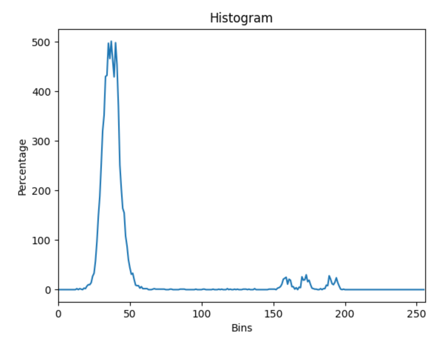

# Beeldherkenning
***Qing Scholten***

### Opdracht 1
1. -

2. -

3. De ring het dichtst bij de camera dient voor het toelaten van de hoeveelheid licht (diafragma). De ring het verste weg van de camera verstelt de zoom.  De gain introduceert meer ruis als het hoger gezet wordt. De exposure past de helderheid van de afbeelding aan. Bij het verhogen van de diafragma moet de exposure ook verhoogd worden.

4. -

5. -

6. Het diafragma staat op de hoogste stand (zo open mogenlijk) en de zoom is dusdanig ingesteld dat de objecten zo scherp mogelijk te zien zijn. De Exposure Time is 20000 en wordt handmatig gezet. De automatische witbalans wordt uitgezet zodat er geen color shift plaatsvindt op basis van het gedetecteerde licht. Er wordt geen lichtbron meegegeven. Dit zorgt er voor dat de camera geen color shift doet op basis van het meegeven omgevingslicht. Ook wordt de auto gain op "off" gezet. Zo wordte de gain niet automatisch aangepast op de helderheid van het beeld. De gain is ingesteld op het maximale (48) zodat er zo veel mogelijk licht op de afbeelding valt om zo zo veel mogelijk contrast te bereiken tussen de objecten en de achtergrond.

### Opdracht 2
1. -

2. -

3. 

4.

5.

# Stappenplan
**Aquisitie**: Voor de aquisitie van beelden is het nodig om de camera zo in te stellen dat het beeld zo scherp mogelijk is. Zo wordt zo veel mogelijk informatie opgenomen. Aangezien het niet mogelijk is om meer informatie te halen uit beelden dan dat er is opgenomen is het zaak om zo veel mogelijk informatie op te nemen. Door te werken met de camera's van het lab, welke ruwe, onbewerkte informatie van de sensor sturen naar de computer, gaat er geen informatie verloren door compressie methoden. De scherpte-diepte van de verkregen afbeeldingen hoort laag te zijn. De belichtingstijd is hoog zodat er genoeg licht op de sensor valt. Dit kan doordat er gewerkt wordt met stilliggende voorwerpen, dus er is geen sprake van bewegingsonscherpte. Ook zorgt de maximale opening van het diafragma voor veel licht op de sensor. Bij het herkennen van spijkers, schroeven, bouten en moeren is het niet nodig om een hoge scherpte diepte te hebben, aangezien alle voorwerpen op de voorgrond liggen en de achtergrond niet scherp hoeft te zijn. Ook moet de gain zo groot mogelijk zijn om het contrast tussen de donkere achtergrond en de lichte voorwerpen zo groot mogelijk te maken.

**Enhancement**: Eerst zal de afbeelding naar grijswaarden worden omgezet. Het gaat om het herkennen van objecten die herkenbaar zijn door hun vorm, niet door de kleur. Op deze manier kan segmentatie plaatsvinden op basis van helderheid en kan er gewerkt worden met 1 waarde in plaats van met 3 waardes. Voor de enhancement wordt gebruik gemaakt van contrastverhoging. Dit zorgt er voor dat de spijkers, schroeven en moeren beter te onderscheiden zijn van de donkere achtergrond. Dit is mogelijk door gebruik van histogram equalisation. Ook zal er gebruik gemaakt worden van edge detection om de randen van de voorwerpen te kunnen herkennen. Op die manier kan de vorm van de objecten in beeld gebracht worden en kan er herkenning van de vormen plaatsvinden. Ook wordt er gebruik gemaakt van mediaan filtering om zo de ruis in de afbeelding te verwijderen.

**Segmentatie**: Voor segmentatie wordt gebruik gemaakt van thresholding. Dit wordt gedaan op basis van grijswaarden. Op deze manier worden de lichte delen van het beeld gebruikt aangezien die delen de objecten bevatten. Daarnaast wordt er gebruik gemaakt van background substractions. Aangezien de achtergrond waarmee gewerkt zal worden zwart zal zijn, waardoor alleen de voorgrond over blijft. De voorgrond zijn de schroeven, spijkers, bouten en moeren welke licht zullen zijn.

**Feature Extraction**: Voor Feature Extraction wordt gekeken naar oppervlakten van lichte kleuren en gaten. Ook zal er gewerkt worden met template matching om de schroeven, moeren, spijkers en bouten te kunnen onderscheiden. Hierbij zal gebruik gemaakt worden van een methode die scale- en rotation invariant, aangezien niet elke schroef, bout of moer even groot op beeld te zien zal zijn. Hierbij zal vooral gekeken worden naar de hoeken en randen voor het zoeken naar een match. 

**Pattern Recognition**: Voor de pattern recognition gebruik ik K-means om de objecten van de achtergrond te onderscheiden. Met behulp van beslisbomen wordt herkent welk voorwerp wat is.

# Uitwerking
**Aquisitie**: Voor de aquisitie heb ik de de objecten zo scherp mogelijk gefilmd en de afbeelding overbelicht omdat zo het contrast tussen de objecten en de achtergrond groter zijn.
**Enhancement**: Voor de enhancement heb ik de afbeelding naar grijswaarden gezet, aangezien alle objecten dezelfde kleur hebben, maakt dit het makkelijker om de objecten te onderscheiden. Daarna heb ik er een Gauss filter overheen gedaan om de ruis van de achtergrond weg te filteren. 
**Segmentatie**: Voor de segmentatie heb ik de geresulteerde afbeelding gethreshhold. Hierdoor worden de objecten van de achtergrond onderscheiden. 
**Feature Extraction**: Voor de feature extraction heb ik de contouren gevonden van de objecten die gedetecteerd moesten worden. 
**Pattern Recognition**: Bij pattern recognition heb ik de gevonden contouren vergeleken met de contours van de vooraf ingeladen templates van de verschillende objecten om zo te vinden welke objecten onder welke categorie vallen en hoeveel van welke categorie aanwezig zijn.